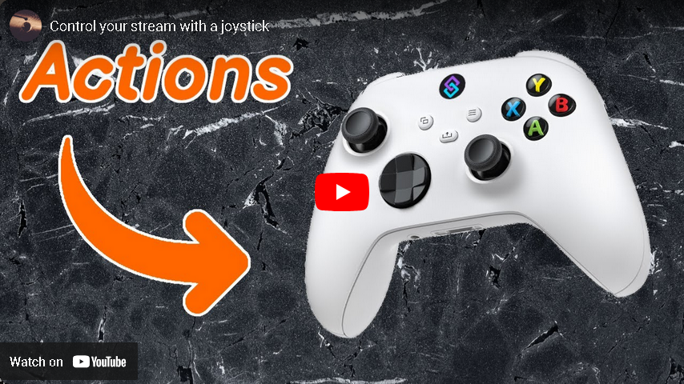

# GamePadActions

This code gives you ability to trigger Streamer.Bot actions via Gamepad.

## Tutorial
[](https://www.youtube.com/watch?v=uNAuaE8XsEM)

## Install
To install, grab .sb file or code import below and put it into import dialog window in Streamer.Bot.

## Import code for Streamer.Bot
```
U0JBRR+LCAAAAAAABADdW1lz6kYWfp+q+Q/UfZ3g0oIATdU8GAxCYPBFAgEap1KSWghZrSVIrFP573O6hTbA9s2dZCaTVLliqVvdZ/m+s7T7/uuvf6nVvvh2Ynz5e+1f5AEeA8O34fGLBP//aqBHK3HDIP7yw2XY2CWbcEsmzDa2unEDN3BeAjsf39vbGD4gE9gH7oHJB5AdW1s3Si6Ds40b16wQ2TXH3dtx7RTuaobpYjc51ZKwlmxdx7G3NTXZ2iDI9qETJjUjlaW2d40aES8y0ENZsFDZBam8sEOwwzgb80FMf+druWxkkIz9Qmd8QUbFBJd94M0/0ze1bIgOu4gowKO1yXKcXW+2eLbeMFm7biC+WW9zNs/yAi+0DJQJRz/7eWfvqGWFptCyRWTUeVij3rCsdd1sN/k6YtYMstkm0xCYypd2YJjYJrsm251dGTlaeIfs/jb0B26chNsTTFobOH5v1lc7QOCxe7OuHP+TmhjbpCKHsw13UWlKZdDAB+MUgwfurb01AhT6uW9uxq0wsHbbrR0k90YvYKAO+bE8EO/Mx1tfXfnrYgLb2iV2FwAnU/cJYHcRNY06WjfNeqMlNsF9bbFuNk3EtFiOt7h2Wb8URzaAn35+Y5xUzV3wEszd2QZAi+5okgpt7G3Fjnc4mYWasXWJbz+aW5lVQnU+KcUjaljsuskbdbEFoGy0kVBvAxbromU0OWHNWoLZuBH4YLvOhticeWCux5JTRHYU4b/29VhkEF9RS96T6F3ApvIGyD6SPcvvfykefqwiA2Mjim0kEfClEMiGf/nhfXoCl5qm1WbqTdEC/5rA0baNmnWRb8HIem2ZDeE3p+dHzPut+flnYeYHatHxq7xxyzl7bYN4ln2zEx3u/v31dQGICw/x6+vYtbZhHK6Th0lv9vra38Keh3DrNRuvr/vGA/PAMzwrvr76sRVusWs+IIyvN4Q1H15f1VOc2P7DzD4mD8M4DD6dObZ98D6dVp3147VC5imNU5TUy0lk+pYz5/EZSVrycmBG1++e8ZA1AyUyF/OduhAYfTncW/0JtgI9WnHa+f43Smj52kaX8E4/x5NuoJ2NhRDI/Ylg8Qo2VWE4u//+yeSOsb6YMMZC3FknYaAvBGz5+O2dfbA9mO7UYLI332A9hxlZA801JfwmS5N4tZyc5d5kqvbwziSyTJmRDevI3Q5834c9xg7se6Iy9PpvSMJ7M5gMLF9kre6jKHeHg9WCxXOp7y2ZbHzsvry7xnGvs52TvtAj++p7+Slsyl259TQNHXkwYVZLJVqdOq7JibHc03arxRD0njpf1Y6/WhzP+gz0cR/J2htE9OnBfB78wAkbK/Da2Z7PRI7BkNjlb7IU7e15rkfPADvKT4xj+hr/Ld+Put61fGNjOWG+gu3QU8MxfFFQF8q5WPMYWfy0DeswX10nSu3yCH7A2Ay0JLcpVgRLmlN9Uvs/OvmYC3Z6msZ0X3g/5cTEXGg7ROz31DuMnzz63Rp8R+f0E8mU+oHFMvQ94IM11U4XLRUGdAPZQsfiNnsrmF7t1wPbPh6fH7NnmTyf8ue+Q56Z4tkjz41i/rFL9B7PVrmsc4+ucR67B7oXYGJhLMAuMG/yVug05zYby5/T/cdvTv5+1h9TGSblNTF9x45n8rXePVM6Ds1lh+gWyhiBz9jk2VdisytHy2kVk/pyQ7i6k4nvup2fTR4P9KUyNflJ3+5uIjOYOmhO8IJ7gAHA7MpRPVFX54I0Y7SVPOj8bKgXPPw2e7+gBdvTl/o5x1k/mQH2WMDleLXEe7SchjOpL5i8xqgc8LUrzPRlnwUfw7r9eKQxlONyiln4blqROcVunPnigIBTRB6CT1lS+DmHmxmv7o0r/nGj8+NW5osillA9PMRuDuaH4/iT8eiT8eEn49on4/rH48yQRQOFxLDP53jAq8UQW28f2LMnLl4yfg067Mo/kphBsaUPkKovaZ7A+lPvI52xxWkn5Gve+LJXjnkJ4sCCcWZzdrbQJv05lq84PezMGcqrQ8HTYUfpKX3Nw08KYJtwcXSZNzo9siM15+pwhvXOrN/pzL3+5Grecax6JI6JIEc5zoxmLP5IjuPk7bHgcq+vzjTK53Dq9WeK+riVn+ZREWO0l3nvqCkM6is0X2y6U9BT7sbO5FTd//kUkufcB8gXIx10MH3MAJ/IGLHxsKuR2D1kLhwbEluO3HaaS3LbD/cmd3CU5QavgGu66kRX3OFWS9lRId5Pl8NTEe+jr4s5flE8sb/o5vEe9Kd552S5AvhzEtk01nUmIMfZkPrxMybvtK+6uxlBLOhYgXz/W0aPVwtE88v4bc4W2NI3ltsh3w51Yiea57BnsfFhWfCZNyQc62BrZSFsAItY73rZWI6/TDf9ohfJaQqnMXNJPCtLJ1RpjpvG8mCI9XTPqrzwY0CsHEkayPy4Ib4lfBjN2cmcxTNFG6rPHsVDVNqztH+uD3BjOLvkXmKvPsmZzx7CqCdsoN4K0QAf9IXoj3rF2oBfKvuIYKlH+bEj8s/8fqKrG8ZedrDJrUISFyvzczulP1O2Iz97UK8wCl4FWjDqTl2bKdUvA3aoQC61mdTW68s6Ji87NvDVCpgm/T+eMFCf7XSeca/3mPPK3irjJLXFCXIBa/kNR/f7scXNy77J8U6fJX1P6sgV5wA3E2xr+sYcaKSeiqy3Y1a3xKReoTKcG87qUjuS+HKvHhpNC1nsqlw0bkEsOiKoP1ZcGleuZL/sicyl2tnqS3zO+JHt++yBnKows6RjhLpOMDpZ1/r7Jj/EMD8Evmc6OAanCanM8P1yQjFXxUzVtrBOUfNIl5jtpjEkez+ap/gAe53AziU85XkggtwPenhXMpL9IHYvNWz6E0z0K9tl3b1gfnFZ560qWx6/q3gn9pqCP8+wlke5t5zkz6M8DhyAWyQ34PMl97/pgD1iH4uhcWIM7wIk3eAq0l2QC+bNgbsWPynx/56/SeyB3qArjE0O9XTQRT85nhwk5JnI5RvLjajOpxUOzAs7NOVBUsi4JPpAL5DvLd+xKbVDZLHQUxFfpfuraCF0LrV5l+wzkrLaWFhAL8DqWR1WWusb+HtZswF8vVovkzXQdi9upwV+IDKIsnu1z4Ap7DfIaq/0WZM2sE/fg9gOfYt2GJFavVt8X8YA2JJBpB4cKCe0uPA9X+/SA0n4XPhtQ/LscObpXxXNyfPQ8y1H40sdAThnXYhPX3WvwPZVTsvjzqiSc/L5ztDtlDAH9f+sivuhuypk8RV+GoBekribQdxe+RqJA5CbLnWTJ/rZuHW+qmuKWinVvZ/n7Ku64nN8kv7QChSwWScmvRrITuJJKRbT+nuoD0gd0pGAtx7RAb6D/j0pavE8r11y6wl6cT7tw0gczONmOQ6B3Cb/GFbiPvgQDbST6Vb72GpspzJlmD8rUJPQfq9Hcl/eZ4fT7ByAQZB3AGPFWn3T70Mtk8YR0guU9unbkvYGMRCXdfsEg3ldtfLFvdntzMBvh+/0x94adD7yR0X26xz4iZyVflwhOY9geUnsNNlap5s67mnec3YzSQwUSXPRwoICcdgiz4Rruo8b68URasGE5iDdF0+yhKD20A4r0ueX4gHy+zBGcEHqLwGj6tlACQN/yNqRxAeIDcRWlAfv96TwDbVDd0P1MFRyDvHYkiWIB93KOuTddnT69TWmAXmE4KWQvxx3v8VnpPbstMj6a/XD2vRQrndg7TfgG2BFKPGF1FmU7x1dmoaGej+Gf0O+8Um8ANy3DMDOszfZQ05h1monIGdgltSHPaBGXyqh3MM9+L01z86gwJ7GohHKkPvJD/l+BDmqjL+cF0TW63j6LWdjV7ElP7OT0tiS1s9XfM/qylPHNxZHUncyBo1Tj64Ov6+04yaLYc9+dIZc677cfvuzxYk7oivBAnAWehRBJblzujjGmqQ1UHdTWp/qXOESwU8RC4mu9Jxwpy8th8ZOohPw057drYlTbma5e3A5c4UcS+RSJPENMI1JXjXIOaqn7FeE4z2ij9AzuQmbnscJU8JJ6DFyfUbqXeyn64I+6XedE+Q4eg5ZrC+o5F0+56mExXTfPsTHRKfnDHn9nr+jMWgAPSw/pb0P8GJvAebRwAtlvzinreSlx4IHhN9g/zfwZUjPjj0NapjUBtX+4d7eAu3TgHsbJGkQj4YbG/rnD/oK6sPVf+q/Uh1bYPcin5diuNqHAN77YHue9JmKMOoOg/RcW47SsQyfN3X0pR7L1q6cTV/w3rhj93yeO1IFElu7ZB2w864cWy/xxgf8Zdwp8mF35d/RSbzH0fdr+iv8DCbsynsHQ0WdTc9GwT4H8CsD/nQtXnNzzp3u1fI5v93i7JnELPmmVr/1F/bem/sRNssylfgVQa11hvqlqKeyscEY5pF6VDutoB4i+Xi19MLRlQ1vzidK/dT9PW/tRXtL9YKtHqkJxifwO62hL/1cJt+cnFGQ/GCmekW3exOMFHU54K6sX+7DOxjn0n7pM4yXcmUZH4Wtb/Ed0L9hZNgewpzz2HUiis/0PD3K7KRRW2Q9XeMd/apY+FY7Z/xWC55lZ0g3ceLmPKXk11XWm5xofe/Kbqe97mb8Fug5W/r+GitEdvAd+ZtgoGFi1+7UG5Kfaz3v5K3ddKFAf5v7Ni7b4Vr+dSmm5r+X+9Df83yo3OcUdf/Q9PX9ndpHutQ+eSwgfXXlTGhZxGbrHN7rycs9QrlXyvvWO/Ys+oOA+cfNX6+jrW2FfuTSyx33LksgGxun9LbJ73Gf5Pbv6e73X4/5xtsk4v/fbRKxLaA2Mrm6LRhCvcFYqG6YYB2rJbBrs8nyiLfu3ia50ud/dFfkp/QuRu/oGxG2P7w58tPVhT866Y99g2Rv4PTmTmeXJGFQC7c14JTpBgb5/IfaLrZrf6uZdnKwg5pJ58S1dXXWww2YASr0nuP7N67ERqttM0KzbiK2VW/wbRtA0SBXhkzgCs9byOK/hyMsw/w3KPLDRzZNr0DK3wV+usB2F8i+byMjsfHpPbno8qzV5HnBFOstwWLBeM123WREpt4WuXWzaVsix3PfY8bG72JD9vcMM2uBhfCILAizvAiIspi60WDbddFk12yD40zUtu9fWuMMluVbZrMuGg2bYJGvt02GrTMtbg3W5JEgtv4Qd0rD6M9yce23v1JatU2q5f/wRqnI2bzIN4R6yyDERC2mLgpruw6xAOKe2WIMofVnu1Ga/pLNT/n1yUXwX31f1MSh5X3jJc9viRq/mvu/QoDenhDoPfNAAvWBhhUWAQLMGNa3E9Xe7q8oVgx2sQsrVwcT18/mkzeXy/nFvyjg+PSNfYzCbWIjEnzSf2jAPLCphrdX/ekoxFEcbQyY9de//PJvwvYbD/cwAAA=
```

## Imports
```
mscorlib.dll
System.Text.Json.dll
System.Memory.dll
```

## Configuration
Create an Action inside `GamePad_Actions` group.

It must contain:
* comment, where you write which button you want to use;
* and one Run Action sub-action, which call actual Action.

How to run `GamePad_Start` and `GamePad_Stop` actions is up to you, you can use any trigger.

Don't forget, when you change anything in `GamePad_Actions` group:
* run `GamePad_Stop`, so it stops listener;
* press Save in SB, because this pushes changes to the file and this extension reads them from it;
* and start listener again with `GamePad_Start`.

List of possible buttons:

* A
* B
* X
* Y
* LB
* RB
* View
* Share
* LS
* RS